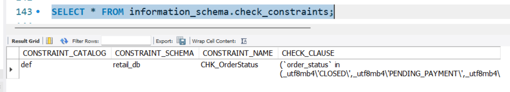

# Day 06 - CHECK Constraints

**SQL Constraints**

- Specifies rules for data in a table.
- Ensures the accuracy & reliability of data.

**WHEN can constraints be defined?:**

- At <u>*table creation time*</u>, we can specify constraint(s) using `CREATE TABLE` statement; OR
- At a later point of time when table already exists, we can <u>*alter the table definition & add a
constraint*</u>, using `ALTER TABLE ... ADD CONSTRAINT` or similar statement.

## Orders table, and validating `order_status` column value

### Create "orders" table

We currently have the below SQL CREATE TABLE statement for creating our `orders` table:

```sql
CREATE TABLE orders (
    order_id INT,
    order_item_id INT,
    order_date DATE,
    customer_id INT,
    order_status VARCHAR(30),
    product_id INT,
    quantity INT,
    product_price FLOAT,
    total_price FLOAT
);
```
### "order_status" - permitted set of values

Currently, we can have any value placed under `order_status` column.

But we have a fixed set of allowed values that can only be used in this column.

We will enforce this with a CHECK constraint.

**Valid values of `order_status`:**

- CLOSED
- PENDING_PAYMENT
- COMPLETE
- PROCESSING
- ON_HOLD
- SUSPECTED_FRAUD
- PENDING

**No constraints yet - Can insert any VARCHAR(30) string in "order_status"**

Below, we try to insert a record in "orders" table, with the value 'CLOSE' in "order_status" column
(which is an invalid value for this column):

```sql
INSERT INTO orders VALUES
(1, 1, '2013-07-25', 11599, 'CLOSE', 957, 1, 299.98, 299.98);
```

### Add CHECK constraint using ALTER TABLE

Here we use CHECK constraint without providing a name for the constraint:

```sql
ALTER TABLE orders
    ADD CHECK(order_status IN
        ('CLOSED', 'PENDING_PAYMENT', 'COMPLETE', 'PROCESSING',
        'ON_HOLD', 'SUSPECTED_FRAUD', 'PENDING')
    );
```

**Adding Constraint FAILS: Existing data in table doesn't conform to the new constraint**

Recall that, we had inserted a record in the "orders" table and the record had a value 'CLOSE' in
the "order_status" column.

This value is not permitted per the new CHECK constraint we are creating.

Therefore the `ALTER TABLE .. ADD CHECK` statement above, fails to execute, as the existing data in
the table, is not valid according to this new constraint.

The error received (*"Check constraint is violated"*) when executing the above `ALTER TABLE .. ADD
CHECK` statement, to add the constraint, is as follows:

```txt
Error Code: 3819. Check constraint 'orders_chk_1' is violated.
```

**Note:** In above error message, we can see that MySQL has auto-generated a name for this
constraint `'orders_chk_1'`.<br>
In our `ALTER TABLE .. ADD CHECK` statement, we didn't provide any name for this constraint.
Actually this variant of the ALTER TABLE statement doesn't have option to add a constraint name.<br>
We will show how to use `ALTER TABLE .. ADD CONSTRAINT 'constraint_name' <CONSTRAINT-DEFINITION>`
variant to provide a custom name for the constraint (which will help when we need to refer to that
constraint later, like when dropping it).

**Delete invalid record(s) first - before adding the constraint:**

We do that using below DELETE statement:

```sql
DELETE FROM orders WHERE order_status = 'CLOSE';
```

Now our table doesn't have any records which could violate this new constraint we are trying to
add.

**Re-run ALTER TABLE .. ADD CHECK, after invalid data has been rectified:**

This time, our ALTER TABLE command must work:

```sql
ALTER TABLE orders
    ADD CHECK(order_status IN
        ('CLOSED', 'PENDING_PAYMENT', 'COMPLETE', 'PROCESSING',
        'ON_HOLD', 'SUSPECTED_FRAUD', 'PENDING')
    );
```

And, this does work now! We have added a new CHECK constraint (with an auto-generated name) that
checks the value of "order_status" column in the "orders" table.

### Test if constraint works

**Test inserting invalid record:**

By trying to insert the same record which had an invalid value of "order_status" column:

```sql
INSERT INTO orders VALUES
(1, 1, '2013-07-25', 11599, 'CLOSE', 957, 1, 299.98, 299.98);
```

As expected above INSERT fails due to *CHECK constraint violation* & gives below error:

```txt
Error Code: 3819. Check constraint 'orders_chk_1' is violated.
```

**Test inserting valid record:**

```sql
INSERT INTO orders VALUES
(1, 1, '2013-07-25', 11599, 'CLOSED', 957, 1, 299.98, 299.98);
```

And, above INSERT works fine - the (valid) record gets inserted.

_This means that the new constraint is added properly & is working fine._

### Find name of constraint

**Using CREATE TABLE script:**

For an existing table, we can ask MySQL to output the `CREATE TABLE` script that can be used to
re-create that table. This script would also include the constraints, with their names (either
user-provided names, or auto-generated names). So, that will allow us to find the name of the
constraint we are interested in.

Use this command to get the `CREATE TABLE` script for an existing table:

```sql
-- Syntax:
-- SHOW CREATE TABLE <table_name>;
SHOW CREATE TABLE orders;
```

This gives *output* containing the below string:

```sql
CREATE TABLE `orders` (
    `order_id` int DEFAULT NULL,
    `order_item_id` int DEFAULT NULL,
    `order_date` date DEFAULT NULL,
    `customer_id` int DEFAULT NULL,
    `order_status` varchar(30) DEFAULT NULL,
    `product_id` int DEFAULT NULL,
    `quantity` int DEFAULT NULL,
    `product_price` float DEFAULT NULL,
    `total_price` float DEFAULT NULL,
    CONSTRAINT `orders_chk_1` CHECK (
        (`order_status` in (_utf8mb4'CLOSED', _utf8mb4'PENDING_PAYMENT',
            _utf8mb4'COMPLETE', _utf8mb4'PROCESSING', _utf8mb4'ON_HOLD',
            _utf8mb4'SUSPECTED_FRAUD', _utf8mb4'PENDING')
        )
    )
) ENGINE=InnoDB DEFAULT CHARSET=utf8mb4 COLLATE=utf8mb4_0900_ai_ci;
```

**Name of constraint:** From above CREATE TABLE script, we find the (auto-generated) name of the
CHECK constraint to be: **`orders_chk_1`**.

### Specify constraint while table creation

From the above CREATE TABLE script, we see how to create (or specify) constraint(s) while creating
the table:

**1. Column-Level constraints:**

These are placed immediately after the data type. They are simple to write but can only refer to that specific column.

> **Note**: The <u>*use of CONSTRAINT keyword*</u> will let us provide a custom name for the constraint.
> When omitting the CONSTRAINT keyword, we don't have option to provide a custom name for the constraint,
> and in that case, MySQL will assign an auto-generated name for it.

```sql
CREATE TABLE users (
    user_id INT PRIMARY KEY AUTO_INCREMENT, -- Primary Key
    username VARCHAR(50) NOT NULL UNIQUE, -- Not Null & Unique

    status VARCHAR(10) DEFAULT 'active', -- Default value

    -- Below we define an UN-NAMED constraint for the `age` column:
    -- (Since we don't use the CONSTRAINT keyword)
    age INT CHECK (age >= 18), -- Check constraint (MySQL 8.0.16+)

    -- Below we define a NAMED constraint called `users_chk_wallet_balance`
    -- for the `wallet_balance` column:
    -- (Note: usage of CONSTRAINT keyword)
    wallet_balance INT CONSTRAINT users_chk_wallet_balance
        CHECK (wallet_balance >= 0)
);
```

OR using our "orders" table example of adding CHECK constraint on "order_status" column, as a _column-level constraint_:

```sql
CREATE TABLE orders (
    order_id INT,
    order_item_id INT,
    order_date DATE,
    customer_id INT,
    order_status VARCHAR(30) CHECK (
        order_status IN ('CLOSED', 'PENDING_PAYMENT',
                'COMPLETE', 'PROCESSING', 'ON_HOLD',
                'SUSPECTED_FRAUD', 'PENDING'
            )
        ),
    product_id INT,
    quantity INT CONSTRAINT orders_chk_quantity CHECK (quantity <= 50),
    product_price FLOAT,
    total_price FLOAT
);
```

**2. Table-Level constraints:**

- These are listed after all column definitions.
- They are necessary for composite keys (keys involving multiple columns), and
- These allow you to provide a <u>*custom name for the constraint*</u> using the **CONSTRAINT keyword**.

```sql
CREATE TABLE project_members (
    project_id INT,
    user_id INT,
    role VARCHAR(20),
    -- Column definition done.

    -- Constraints below:

    -- Composite Primary Key
    PRIMARY KEY (project_id, user_id),

    -- Named Foreign Key
    CONSTRAINT fk_user 
        FOREIGN KEY (user_id) REFERENCES users(user_id),

    -- Named Check Constraint
    CONSTRAINT chk_role 
        CHECK (role IN ('Lead', 'Developer', 'Designer'))
);
```

### Deleting (dropping) a constraint

While modern MySQL versions (8.0.19+) support a generic `DROP CONSTRAINT` command,
older versions often require type-specific commands like `DROP FOREIGN KEY` or `DROP INDEX`.

#### 1. Generic Syntax (MySQL 8.0.19 and newer)

This is the <u>standard SQL</u> syntax for deleting most *named constraints*:

```sql
ALTER TABLE table_name 
DROP CONSTRAINT constraint_name;
```

#### 2. Constraint-Type Specific Syntax

Here we need to mention the type of the constraint (like `FOREIGN KEY`, `CHECK`,
`INDEX`, `PRIMARY KEY`), *instead of the keyword `CONSTRAINT`* like in the previous
generic syntax.

```sql
-- Drop a Foreign Key constraint:
ALTER TABLE table_name 
DROP FOREIGN KEY constraint_name;

-- Drop a Check constraint:
ALTER TABLE table_name 
DROP CHECK constraint_name;

-- Drop a Unique (technically an Index) constraint:
ALTER TABLE table_name 
DROP INDEX constraint_name;

-- Drop a Primary Key constraint:
ALTER TABLE table_name 
DROP PRIMARY KEY; -- NOTE BELOW

-- NOTE: Since a table can only have one primary key, you don't need a name.
```

### Drop CHECK constraint named `orders_chk_1`

Using the below statement using Constraint-Type Specific Syntax:

```sql
ALTER TABLE orders
DROP CHECK orders_chk_1;
```

### Add named constraint with ALTER TABLE statement & CONSTRAINT keyword

Use the syntax:

```
ALTER TABLE <table_name> ADD CONSTRAINT [constraint_name]
    <Constraint-Type Constrait-Definition>
```

**Example:** Add CHECK constraint with name `"CHK_OrderStatus"`

```sql
ALTER TABLE orders
    ADD CONSTRAINT CHK_OrderStatus CHECK(order_status IN
        ('CLOSED', 'PENDING_PAYMENT', 'COMPLETE', 'PROCESSING',
        'ON_HOLD', 'SUSPECTED_FRAUD', 'PENDING')
    );
-- Note: Here Contraint-Type was CHECK.
```

### Constraint info using "information_schema"

Connect to "information_schema" database:

```sql
USE information_schema;
SELECT DATABASE();
```

Find tables in it, with names ending with 'constraints':

> **💡 Tip:** We can use LIKE Operator with commands like `SHOW TABLES;` & `SHOW DATABASES;`
> ```sql
> SHOW TABLES LIKE '%constraints';
> -- OR:
> -- SHOW DATABASES LIKE 'flipkartdb%';
> -- OR:
> SHOW FULL TABLES LIKE '%constraints';
> ```
> **Note:** SHOW FULL TABLES; gives extra "table_type" info (e.g. SYSTEM VIEW, BASE TABLE etc.)
> in addition to just Table Name.

OR, In order to get the same (& a bit more) info as with `SHOW TABLES LIKE '%constraints';`
command, we can use the "information_schema.tables" like this:

```sql
DESCRIBE information_schema.tables;

SELECT table_name FROM information_schema.tables
	WHERE table_schema = 'information_schema'
    AND table_name LIKE '%constraints';
```

There are 3 tables in information_schema which store info about various
constraints defined in this MySQL instance's database tables:
1. Table `information_schema.check_constraints`
1. Table `information_schema.referential_constraints`
1. Table `information_schema.table_constraints`

#### Using "information_schema.check_constraints" table

"check_constraints" table under "information_schema" database has theese four (4) columns:

    "constraint_catalog", "constraint_schema", "constraint_name", "check_clause".

Let's check the contents of this table:

```sql
SELECT * FROM information_schema.check_constraints;
```


*Figure: Table Contents of information_schema.check_constraints*

Here:

- **"constraint_schema":** Holds the name of the database (e.g. "retail_db") within which our constraint is created.
- **"constraint_name":** Holds the name of the constraint (e.g. 'CHK_OrderStatus').
- **"check_clause":** Holds the CHECK clause used to define this particular check constraint. E.g.:
    ```sql
    (`order_status` IN
        ('CLOSED', 'PENDING_PAYMENT', 'COMPLETE', 'PROCESSING',
        'ON_HOLD', 'SUSPECTED_FRAUD', 'PENDING')
    )
    ```


## More Examples

### Pesons table - Check age is a positive integer

"persons" Table definition with CHECK Constraint on "age" column specified:

```sql
CREATE TABLE persons (
    person_id INT,
    first_name VARCHAR(50),
    last_name VARCHAR(50),
    
    -- Constraint specified as a Column-Level constraint:
    age INT CHECK (age > 0)
);

-- Test constraint with attempting to insert invalid record (age = -5):
INSERT INTO persons (person_id, first_name, last_name, age)
VALUES (1, 'Raj', 'Sharma', -5);
-- Error Code: 3819. Check constraint 'persons_chk_1' is violated.
```

Other ways to specify this CHECK constraint in CREATE TABLE statment:
1. As a column-level constraint, without the CONSTRAINT keyword, i.e. without constraint name.
    As shown above.
1. As a column-level constraint, with the CONSTRAINT keyword & the constraint name.
    ```sql
    CREATE TABLE persons (
        ...
        age INT CONSTRAINT persons_chk_age CHECK (age > 0),
        ...
    );
    ```
1. As a table-level constraint, without the CONSTRAINT keyword, i.e. without constraint name.
    ```sql
    CREATE TABLE persons (
        ...
        age INT,
        CHECK (age > 0),
        ...
    );
    ```
1. As a table-level constraint, with the CONSTRAINT keyword & the constraint name.
    ```sql
    CREATE TABLE persons (
        ...
        age INT,
        CONSTRAINT persons_chk_age CHECK (age > 0),
        ...
    );
    ```

### Customers table - Check email &nbsp;*pattern*&nbsp; is about correct

"customers" Table definition with CHECK Constraint on "email" column specified:

(**Note:** Check out how we used the *LIKE Operator* inside the CHECK Clause)

```sql
CREATE TABLE customers (
    user_id INT,
    username VARCHAR(50),
    email VARCHAR(100),
    CHECK (email LIKE '%@%.%')
);

-- Test constraint with valid record:
INSERT INTO customers (user_id, username, email)
VALUES (1, 'sumitm', 'sumit@trendytech.in');
-- Works fine: Record inserted!

-- Test constraint with invalid record:
INSERT INTO customers (user_id, username, email)
VALUES (2, 'manishb', 'manish@california');
-- Error Code: 3819. Check constraint 'customers_chk_1' is violated.
```

### Projects table - Compare dates inside CHECK constraint

"projects" Table definition with CHECK Constraint **that checks and validates based on the value of two columns**:

(Here "projects_chk_enddate_startdate" named CHECK constraint checks the value of "end_date" and "start_date" DATE type columns, and validates that the date in "end_date" MUST BE *AFTER* the date in "start_date")

```sql
CREATE TABLE projects (
    project_id INT,
    project_name VARCHAR(100),
    start_date DATE,
    end_date DATE,
    CONSTRAINT projects_chk_enddate_startdate CHECK (end_date > start_date)
);
SHOW CREATE TABLE projects;

-- Test constraint with valid record:
-- (End Date is after Start Date)
INSERT INTO projects (project_id, project_name, start_date, end_date)
VALUES (1, 'Project Alpha', '2023-01-01', '2023-12-31');
-- Works fine: Record inserted!

-- Test constraint with invalid record:
-- (End Date IS NOT after Start Date)
INSERT INTO projects (project_id, project_name, start_date, end_date)
VALUES (2, 'Project Beta', '2023-01-01', '2022-12-31');
-- Error Code: 3819. Check constraint 'projects_chk_enddate_startdate' is violated.
```
