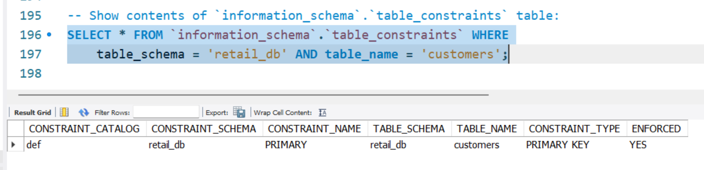
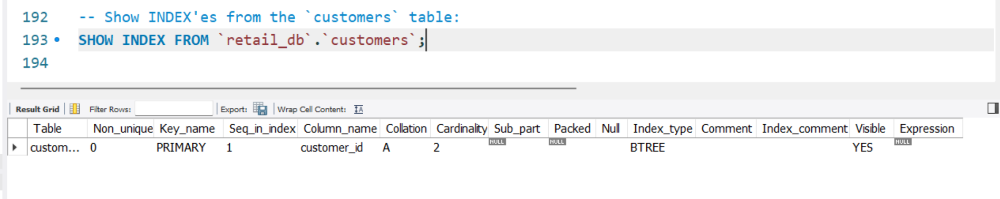

# Day 07 - CONSTRAINTS -- Not Null, and Primary Key

# NOT NULL Constraint

We have this `orders` table:

```sql
DROP TABLE IF EXISTS `orders`;

CREATE TABLE orders (
    order_id INT,
    order_item_id INT,
    order_date DATE,
    customer_id INT,
    order_status VARCHAR(30),
    product_id INT,
    quantity INT,
    product_price FLOAT,
    total_price FLOAT
);
```

## Add NOT NULL Constraint

<u>**Goal: Add NOT NULL Constraint to `order_status` column**</u>

Currently, as no columns have NOT NULL constraint, therefore below INSERT
statement works fine:

(This INSERT adds a new record to the table with NULL value in the
`order_status` column.)

```sql
INSERT INTO orders
    (order_id, order_item_id, order_date, customer_id, order_status,
    product_id, quantity, product_price, total_price)
    VALUES
    (1, 1, '2013-07-25', 11599, NULL, 957, 1, 299.98, 299.98);
```

<u>**Add NOT NULL Constraint in CREATE TABLE**</u>

To define a NOT NULL constraint when creating a table, add NOT NULL after the
data type of the column name.

Here, we have CREATE TABLE statement for "orders" table, where we specify the
"order_status" column to have the NOT NULL constraint:

```sql
CREATE TABLE orders (
    ...
    customer_id INT,
    order_status VARCHAR(30) NOT NULL, -- Note: the "NOT NULL" constraint!
    product_id INT,
    ...
);
```

<u>**Add NOT NULL Constraint to column in existing table using ALTER TABLE**</u>

We use the `ALTER TABLE ... MODIFY [COLUMN] <column_name> <constraint(s)>`
variant of ALTER TABLE statement.

Here, we ALTER the structure of existing "orders" table, and modify column
"order_status" to have the NOT NULL constraint:

```sql
ALTER TABLE orders MODIFY COLUMN order_status VARCHAR(30) NOT NULL;
```

In case, there are existing records in the table that have NULL values in this
column ("order_status"), then above ALTER statement for adding NOT NULL
constraint will fail with below error:

```txt
Error Code: 1138. Invalid use of NULL value
```

Then, we need to make sure there are no records that have NULL value for this
column, for example by setting a placeholder value:

```sql
UPDATE orders SET order_status = 'PENDING' WHERE order_status IS NULL;
```

After the above ALTER TABLE command executes successfully (i.e. after our
constraint has been added), we can verify if the constraint is working, by
trying to INSERT an invalid record (having NULL value in "order_status"
column):

```sql
INSERT INTO orders
    (order_id, order_item_id, order_date, customer_id, order_status,
    product_id, quantity, product_price, total_price)
    VALUES
    (1, 2, '2013-07-25', 11599, NULL, 814, 2, 50.00, 100.00);
```

And, we can see that the above command to try inserting an invalid record does
fail, and it gives this error:

```txt
Error Code: 1048. Column 'order_status' cannot be null
```

## Remove the NOT NULL Constraint from a column

We again use the same ALTER TABLE statement's variant as before (when adding
the constraint):

`ALTER TABLE ... MODIFY [COLUMN] <column_name> <constraint(s)>`

When removing the NOT NULL constraint present on a column, we just specify the
constraint as **NULL** in the above `ALTER TABLE` statement - which means that
NULL value(s) are allowed for this column.

Example: Here we remove the NOT NULL constraint from the "orders.order_status"
table column, which will allow the column to accept NULL values again:

```sql
ALTER TABLE orders MODIFY COLUMN order_status VARCHAR(30) NULL;
```

## Omitting column(s) in INSERT Column-List Syntax

Omitting column(s) in INSERT Column-List Syntax triggers the **default value**
of the omitted columns to be placed in the new record.

For any column where we haven't explicitly provided a **default value**, <u>the
value NULL is used by MySQL by default</u> as the **default value**.

So, assuming our "orders" table, currently to have NOT NULL constraint only on
the "order_status" column alone:

- We can execute an INSERT Column-List Syntax statement, and
- omit specifying the column name & value of any column that doesn't have the
  NOT NULL constraint, and
- we can see that, NULL is automatically populated as the value(s) in those
  column(s), in the newly inserted record.

### What if NOT-NULL Constraint column(s) is/are omitted in INSERT statement?

Let's add NOT NULL constraint on all columns of "orders" table, by re-creating
the table, using `DROP TABLE` and `CREATE TABLE` statements as follows:

(Note: We are not providing default values for any of the columns - which is
done when needed using *DEFAULT* clause.)

```sql
DROP TABLE IF EXISTS `orders`;

CREATE TABLE orders (
    order_id INT NOT NULL,
    order_item_id INT NOT NULL,
    order_date DATE NOT NULL,
    customer_id INT NOT NULL,
    order_status VARCHAR(30) NOT NULL,
    product_id INT NOT NULL,
    quantity INT NOT NULL,
    product_price FLOAT NOT NULL,
    total_price FLOAT NOT NULL
);
```

Now, let us use the INSERT Column-List syntax to insert a new record while
specifying only two columns in the INSERT statement, and see if the INSERT
statement is allowed or not, and what error is received:

```sql
INSERT INTO orders (order_id, order_item_id) VALUES (1, 1);
```

This above INSERT fails with error:

```txt
Error Code: 1364. Field 'order_date' doesn't have a default value
```

The reason might be:
- All omitted column names/values, trigger the placement of default value
  for those respective columns.
- Since none of these columns have an explicit **default value** specified
  using the *DEFAULT* clause,
- MySQL would, under normal circumstances of the column allowing NULL values,
  place the NULL value in the column.
- But, as these columns are having NOT NULL constraints, above is not an
  option for MySQL.
- So it fails the INSERT statement with an error telling that an explicit
  **default value** is absolutely required (but is missing) from this
  column, if you are not providing a value for the column in the INSERT
  statement.

---


# PRIMARY KEY Constraint

<u>**Primary Key:**</u> A set of column(s) which can uniquely identify a record.
The column(s) participating in the **Primary Key** of a table, cannot take NULL
value.

### "customers" Table

We'll refer the below "customers" table in our discussions on PRIMARY KEY:

```sql
DROP TABLE IF EXISTS `customers`;

CREATE TABLE `customers` (
    `customer_id` INT NOT NULL,
    `customer_fname` VARCHAR(50) NOT NULL,
    `customer_lname` VARCHAR(50) NOT NULL,
    `customer_email` VARCHAR(100) NOT NULL,
    `customer_phone` VARCHAR(30),
    `customer_street` VARCHAR(255),
    `customer_city` VARCHAR(50) NOT NULL,
    `customer_state` VARCHAR(50) NOT NULL,
    `customer_zipcode` VARCHAR(10)
) ENGINE=InnoDB DEFAULT CHARSET=utf8mb4 COLLATE=utf8mb4_0900_ai_ci;
```

**Note:**
1. Here we have specified the NOT NULL constraint for all columns, except
   the columns: "customer_phone", "customer_street", and "customer_zipcode".
1. Currently, we have not specified any Primary Key constraint, while creating
   the table, so we're allowed to provide duplicate values for the column(s)
   which we might want to select for Primary Key.
1. That is, if we later plan to select the column set ("customer_id") as the
   Primary Key, then right now, since we haven't yet specified it, we're allowed
   to provide duplicate values for this column.

**Insert Multiple Records With Duplicate Value (Before specifying Primary Key):**

Below, we insert two (2) records with the same value at "customer_id" column:

```sql
INSERT INTO customers VALUES
    (1, 'Richard', 'Hernandez', 'richardhernandez@gmail.com', NULL,
        '6303 Heather Plaza', 'Brownsville', 'TX', '78521'),
    (1, 'Mary', 'Barrett', 'marybarrett@yahoo.com', NULL,
        '9526 New Commercial Avenue', 'Littleton','CO','80126');
```

As expected, above INSERT statement has worked fine.

## Define Primary Key constraint

We can define the Primary Key constraint (and the constraint can be named or
un-named) in multiple ways:

**1. While creating a new table, inside the CREATE TABLE statement.**

- **IF** only __*ONE COLUMN*__ has been selected as the Primary Key. Along-side
  a column definition in the CREATE TABLE statement, like the syntax for a
  column-level constraint.
  ```sql
  -- Un-named PRIMARY KEY Constraint:
  CREATE TABLE customers (
    `customer_id` INT PRIMARY KEY,
    -- Other columns' definitions...
  );
  -- Named PRIMARY KEY Constraint:
  CREATE TABLE customers (
    `customer_id` INT CONSTRAINT `PK_customers` PRIMARY KEY,
    -- Other columns' definitions...
  );
  ```
- **IF** __*MULTIPLE COLUMNS*__ have been selected to participate in the Primary
  Key. After all column definitions in the CREATE TABLE statement, like the
  syntax for a table-level constraint.
  ```sql
  -- Un-named PRIMARY KEY Constraint:
  CREATE TABLE customers (
    `customer_id` INT NOT NULL,
    `customer_fname` VARCHAR(50) NOT NULL,
    `customer_lname` VARCHAR(50) NOT NULL,
    `customer_email` VARCHAR(100) NOT NULL,
    `customer_phone` VARCHAR(30),
    -- Other columns' definitions...
    PRIMARY KEY (`customer_id`, `customer_email`)
  );
  -- Named PRIMARY KEY Constraint:
  CREATE TABLE customers (
    `customer_id` INT NOT NULL,
    `customer_fname` VARCHAR(50) NOT NULL,
    `customer_lname` VARCHAR(50) NOT NULL,
    `customer_email` VARCHAR(100) NOT NULL,
    `customer_phone` VARCHAR(30),
    -- Other columns' definitions...
    CONSTRAINT `PK_customers` PRIMARY KEY (`customer_id`, `customer_email`)
  );
  ```
- Table-level constraint syntax can also be used even when the Primary Key
  contains __*ONLY ONE COLUMN*__ as the participant.
  ```sql
  CREATE TABLE customers (
    `customer_id` INT NOT NULL,
    `customer_fname` VARCHAR(50) NOT NULL,
    -- Other columns' definitions...
    PRIMARY KEY (`customer_id`)
  );
  ```
<br>

**2. By altering an existing table (that doesn't have a Primary Key), using the ALTER TABLE statement.**

**Note:** The set of column(s) to participate in the Primary Key is to mentioned
within parenthesis after the keyword `PRIMARY KEY`, as in:
1. `PRIMARY KEY (customer_id)`, or
2. `PRIMARY KEY (customer_id, customer_email)`.

We use the below syntax to add the Primary Key constraint by altering an
existing table:

- Un-named PRIMARY KEY Constraint:
  ```sql
  -- When SINGLE COLUMN participates in the Primary Key:
  ALTER TABLE customers ADD PRIMARY KEY (customer_id);
  -- When MULTIPLE COLUMNS participate in the Primary Key:
  ALTER TABLE customers ADD PRIMARY KEY (customer_id, customer_email);
  ```
- Named PRIMARY KEY Constraint:
  ```sql
  -- When SINGLE COLUMN participates in the Primary Key:
  ALTER TABLE customers ADD CONSTRAINT PK_customers PRIMARY KEY (customer_id);
  -- When MULTIPLE COLUMNS participate in the Primary Key:
  ALTER TABLE customers ADD CONSTRAINT PK_customers
    PRIMARY KEY (customer_id, customer_email);
  ```

For the above ALTER TABLE command to work, we must first ensure that all the
existing records in the table are such that the column(s) we intend to
include in the Primary Key, the values of such column(s) must be **UNIQUE**.

If while executing the ALTER TABLE command to add the Primary Key, we have
duplicate value(s) for the participating column(s) in some records, then the
ALTER TABLE command will fail with below error:

```txt
Error Code: 1062. Duplicate entry '1' for key 'customers.PRIMARY'
```

We would, then need to first, fix these records by either updating them or
deleting them (if required), and ensure uniqueness. For example, we can do:

```sql
-- Let's fix the duplicate entry by updating "customer_id"
-- column value for record: customer_fname='Mary'
UPDATE customers SET customer_id = 2 WHERE customer_fname='Mary';
```

## MySQL Ignores PRIMARY KEY's Custom Constraint Name

Below text is copied from LLM (might contain mistakes, but is fairly accurate).

In MySQL, the name for a **PRIMARY KEY** is always hardcoded as `PRIMARY`. While
the SQL syntax allows you to provide a custom constraint name (e.g.,
`CONSTRAINT my_custom_pk PRIMARY KEY`), _MySQL will silently ignore it and use_
_the default name instead_.

### Key Behavior Details

- **Static Naming:** Unlike unique or foreign keys where custom names are
  preserved, the primary key name is fixed as `PRIMARY` for all tables.
- **No Error/Warning:** When you define a custom name in a `CREATE TABLE` or
  `ALTER TABLE` statement, MySQL does not return an error; it simply discards
  the name without notification.
- **Verification:** You can confirm this by running `SHOW CREATE TABLE table_name;`
  or querying the `INFORMATION_SCHEMA.TABLE_CONSTRAINTS` table. The constraint
  name will consistently appear as `PRIMARY`.

Below, we inspect `information_schema.table_constraints` table to verify the
name of the Primary Key. Notice the `constraint_name` column value is `'PRIMARY'`:


*Figure: Table Contents of information_schema.table_constraints*
<br>

Also, we examine the result of query `SHOW INDEX FROM [table]` to verify the
name of the Primary Key. Notice the `key_name` column value is `'PRIMARY'`:


*Figure: Result of SOHW INDEX FROM table*


### Why this happens

This is a known architectural limitation in MySQL and MariaDB. Since a table can
have only one primary key, the system uses a reserved, uniform identifier
(`PRIMARY`) to reference it internally and in error messages (e.g.,
"Duplicate entry '...' for key 'PRIMARY'").

### How to Drop a Primary Key

Because the name is always the same, you do not need to know a custom name to
remove it. You can simply use:

```sql
ALTER TABLE table_name DROP PRIMARY KEY;
```

If you attempt to drop it using your ignored custom name (e.g.,
`DROP CONSTRAINT my_custom_pk`), MySQL will return an error stating that the
constraint does not exist.
